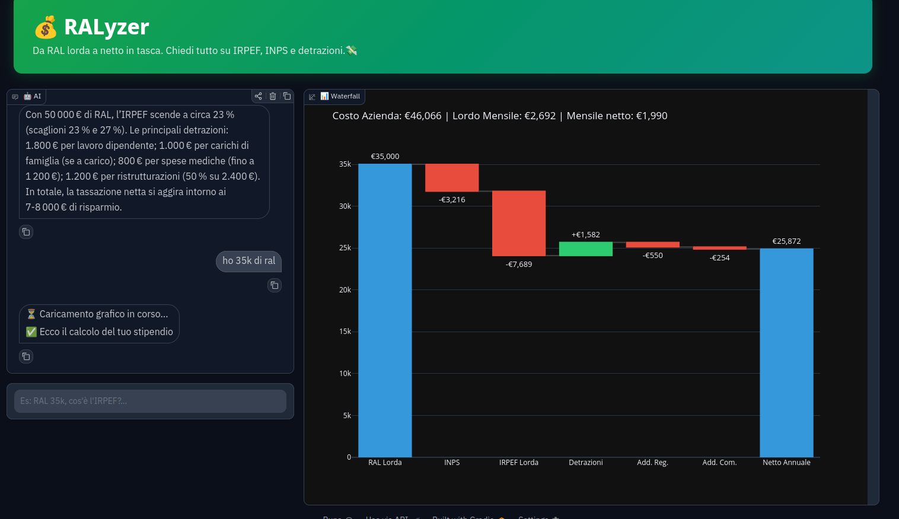
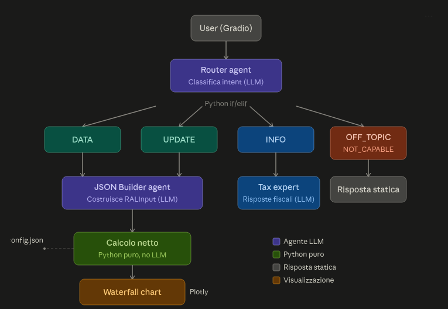

## ⚠️ Disclaimer

Questo strumento è un prototipo a scopo dimostrativo. I calcoli sono basati su parametri fiscali 2026 semplificati e non sostituiscono la consulenza di un commercialista o consulente del lavoro. L'AI può commettere errori nella classificazione e nell'elaborazione dei dati. 

Verificare sempre i risultati.

# 💰 RALyzer — Calcolatore Stipendio Netto con AI
 
Un calcolatore intelligente dello stipendio netto italiano, costruito con un'architettura multi-agent.

L'utente inserisce la propria RAL (Retribuzione Annua Lorda) tramite linguaggio naturale e ottiene un breakdown completo delle voci in busta paga, visualizzato con un waterfall chart interattivo.

Il sistema include guardrail per la gestione di richieste fuori ambito e funzionalità non disponibili, oltre a un agente esperto in fiscalità italiana per rispondere a domande su IRPEF, INPS, detrazioni e addizionali.
 


 
---
 
## 🖥️ Demo
 

---
 
## 🏗️ Architettura


 
**Scelta architetturale chiave:** i calcoli fiscali sono deterministici (moduli Python), non delegati all'LLM. L'AI orchestra e conversa, Python calcola. Le tasse non si calcolano con la probabilità.
 
---
 
## ⚙️ Come funziona
 
**Router Agent** — Classifica l'intent dell'utente in 5 categorie (DATA, UPDATE, INFO, OFF_TOPIC, NOT_CAPABLE) tramite structured output Pydantic e instrada la richiesta verso l'azione corrispondente. Nessun tool, una singola chiamata LLM.

**JSON Builder Agent** — Raccoglie i dati dall'utente e costruisce un oggetto `RALInput` (Pydantic). Se mancano informazioni, chiede chiarimenti. Se tutti i campi hanno un valore (anche di default), procede al calcolo.
 
**Calcolo Netto** — Modulo Python puro che applica le regole fiscali 2026: IRPEF a scaglioni progressivi, contributi INPS, detrazioni lavoro dipendente, cuneo fiscale, addizionali regionali e comunali. I parametri fiscali sono separati dalla logica in `data_ral_maker.json`.
 
**Waterfall Chart** — Grafico interattivo Plotly che mostra il percorso dalla RAL lorda al netto, con ogni voce di detrazione.
 
---
 
## 📊 Voci calcolate
 
| Voce | Descrizione |
|------|-------------|
| RAL Lorda | Retribuzione Annua Lorda inserita dall'utente |
| INPS | Contributi previdenziali dipendente (9,19%) |
| IRPEF Lorda | Imposta progressiva a 3 scaglioni (23% / 33% / 43%) |
| Detrazioni | Detrazioni lavoro dipendente (art. 13 TUIR) |
| Cuneo Fiscale | Detrazione aggiuntiva 2026 per redditi 20k-40k |
| Add. Regionale | Addizionale IRPEF regionale (default Lombardia 1,73%) |
| Add. Comunale | Addizionale IRPEF comunale (default Milano 0,80%) |
| **Netto Annuale** | **Stipendio netto annuale** |
| Netto Mensile | Netto diviso per le mensilità |
| Costo Azienda | RAL + INPS datore + TFR + INAIL |
 
---
 
## 🚀 Setup
 
### Requisiti
 
- Python >= 3.14
- API Key Groq (gratuita)
- API Key OpenAI (per tracing, opzionale)


### Installazione

```bash
git clone https://github.com/TDK-99/Ral_agent.git
cd Ral_agent
pip install -r requirements.txt
cp .env.example .env
```

### Configurazione API Key

Il progetto richiede due API key gratuite:

| Servizio | Scopo | Registrazione |
|----------|-------|---------------|
| **Groq** | Chiamate LLM (router, JSON builder, tax expert) | [console.groq.com](https://console.groq.com) |
| **OpenAI** | Tracing e observability (opzionale) | [platform.openai.com](https://platform.openai.com) |

Inserisci le chiavi nel file `.env`:

```env
OPENAI_API_KEY=...
groq_api_key=...
```
### Esecuzione
 
```bash
python main.py
```
 
L'app crea un link locale e  un URL pubblico temporaneo (es. `https://xxx.gradio.live`) che chiunque può aprire dal browser. 
Il link è attivo finché il PC è acceso e il processo è in esecuzione, con durata massima di una settimana.
 
---
 
## 📁 Struttura progetto
 
```
ral-agent/
├── main.py                  # Entry point: Gradio UI + orchestrazione
├── data_ral_maker.json      # Parametri fiscali 2026 (separati dalla logica)
├── requirements.txt         # Dipendenze con versioni pinnate
├── .env.example             # Template variabili d'ambiente
├── src/
│   ├── __init__.py
│   ├── config.py            # Setup client Groq e modello LLM
│   ├── schemas.py           # Modelli Pydantic (UserIntent, RALInput, RALResult)
│   ├── router_agent.py      # Agente classificatore intent
│   ├── json_builder_agent.py # Agente raccolta dati
│   ├── ral_maker.py         # Calcolo netto (Python puro, no LLM)
│   └── plot_maker.py        # Waterfall chart Plotly
└── tests/                   # Notebook di sviluppo
```
 
---
 
## 🔧 Stack tecnologico
 
| Componente | Tecnologia |
|------------|-----------|
| Agenti | OpenAI Agents SDK (0.19.4) |
| LLM Provider | Groq (openai/gpt-oss-120b) |
| UI | Gradio (6.25.0) |
| Grafici | Plotly (6.9.0) |
| Validazione dati | Pydantic |
| Orchestrazione | Codice Python (if/elif), no handoff LLM |
 
---
 
## 📝 Semplificazioni (v1)
 
Il prototipo copre il caso standard definito nel brief:
 
- Dipendente privato a tempo indeterminato
- Addizionali default Milano/Lombardia (modificabili dall'utente)
- Aliquota INPS 9,19% (standard FPLD)
- No detrazioni familiari (coperti da Assegno Unico Universale per under 21)
- Addizionale regionale flat (non a scaglioni)
---
 
## 🛣️ Roadmap v2
 
- Gestione input stipendio mensile (se importo < soglia, chiedere conferma all'utente)
- Detrazioni figli a carico: integrazione simulazione AUU e detrazioni figli over 21
- Lookup automatico addizionali da città (10 città principali già nel JSON config)
- Addizionale regionale a scaglioni (non flat)
- Trattamento integrativo completo (fascia < 20k)
- Confronto side-by-side tra due RAL ("e se fossero 40k?")
- Deploy permanente
---
 
## 📚 Fonti dati fiscali
 
I parametri fiscali nel progetto sono stati verificati sulle seguenti fonti:
 
- **IRPEF 2026**: Legge di Bilancio 2026 (L. 199/2025, art. 1 co. 3)
- **INPS 9,19%**: Aliquota standard FPLD — fiscomania.com, fyscal.it
- **Detrazioni lavoro dipendente**: Art. 13 TUIR — randstad.it, centrofiscale.com
- **Addizionale comunale Milano**: Delibera comunale — tuttocalcolo.it
- **Addizionale regionale Lombardia**: Tabelle MEF — tuttocalcolo.it
- **Cuneo fiscale 2026**: Agenzia delle Entrate — stipendiocalcolatore.it
- **Costo azienda**: INPS datore 23,81%, TFR, INAIL — stipendionettocalcolatore.it
---
 
## 📄 Licenza
 
MIT — vedi [LICENSE](LICENSE)
 
